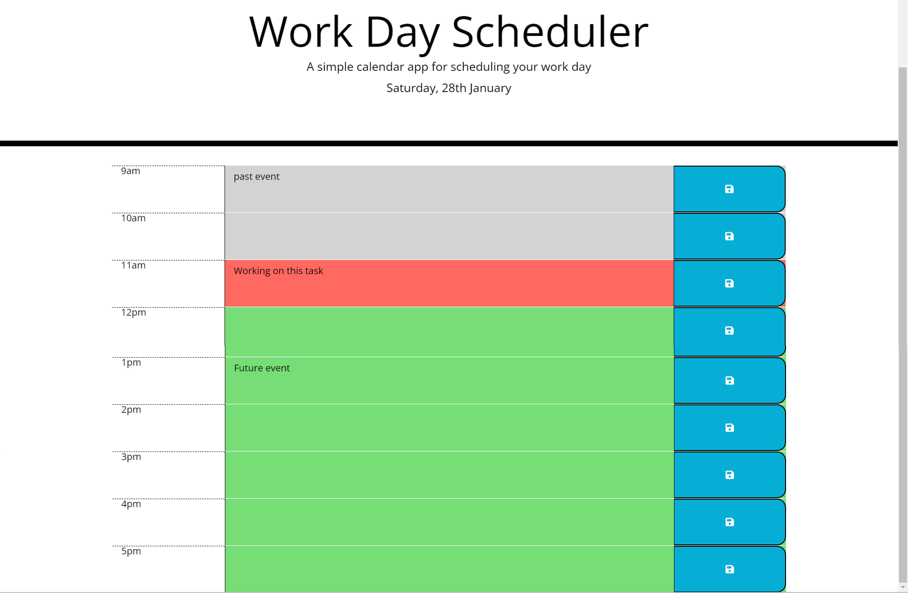

# work-day-planner

Organise your day

## Description

This repository contains a daily planner, where a user can input tasks/events to complete throughout the day. They can enter their TODOs for each hour, at the start of the day and save it in place. As the red colour block appears on the task, that is when it is due to be done. When the task is complete, delete the task. It will update everyday and keep track of the present time as well as future events.  

The website the following features:

- Current day at the top of the page when a user opens the planner.
- Timeblocks for each hour of the working day - colour coded
- The red time block represents the current hour, and moves down the page as the time changes.
- A user can enter an activity when they click a textarea and save it by clicking the blue button.

This site uses moment.js to track the time, and local storage to keep any data the user wishes to save.

## Usage

To use the daily planner, enter your daily to do tasks, and click the blue save button. Your tasks will be saved for the day. As the red colour block enters the task to do, this is when to do the task. After completetion, delete the task and press save, to empty the task slot.

## Screenshot

## The website

This site can be found at https://liamjameswatson.github.io/work-day-scheduler/

## License

MIT License (Please refer to [LICENSE](/LICENSE) in the repo.)
